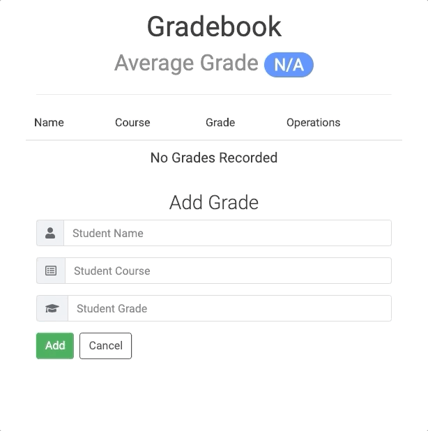

# Gradebook
The Gradebook is a dynamic web application for teachers who want to record the grades of their students.

## Technologies Used
- React.js
- Webpack
- Babel
- Node
- Bootstrap4
- HTML5
- CSS3

## Features
- Users can add a new student's record
- Users can update an existing student's record
- Users can delete an existing student's record
- Users can view the average grade of all students

## Preview

